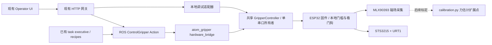

# ESP32 夹爪：系统接入与后续校准

更新：2026-10-03。位置控制、UI 和 ROS 接口已实现；用户已上传连续运动固件并确认前端夹爪集成成功。机械臂与实物夹爪的联合运行仍待验收，夹持力控制尚未实现。

## 当前能做什么

- 在现有 Operator Console 中使能夹爪、张开、闭合、指定编码器位置、停止保持、释放扭矩、人工复位故障、磁场基线归零。
- 显示编码器位置、舵机原始负载/电压/温度、磁场、传感器有效性、故障与执行状态。
- Open = 2600 counts，Close = 2000 counts；仅使用本次空载扫测覆盖的内侧区间，不直接到机械硬限位。UI 以一次 `MOVE <position>` 连续运动到目标，不再按 100 counts 分段；到位判据 ±3 counts。手动调试 JOG 仍限制 ±100 counts。
- 提供统一 ROS Action；机械臂任务通过已有 task executive 的能力与配方调用，不增加每个任务专用 node。
- 保留夹持力目标（N）和力估计扩展点；目前 UI 禁用、服务端拒绝 force 请求，测量值为 unknown，不能拿 load_raw 冒充牛顿。

“Close 完成”仅表示到达编码器目标。放入物体后，位置闭合可能触发负载/超时保护，不能作为自动抓取动作使用。物体接触、夹持力稳定、持有与释放验证需要 G01/G04/G09。

## 已有实物证据及边界

原始证据：`tmp/gripper_bringup/sweep_20261003_150022_860815/`。条件为用户在金属滑轨使用 WD-40 Multi-Use、软件原始负载阈值 80；N=1 次运行、3 轮、72 段（开/闭各 36 段），名义位置范围 2000–2600 counts。所有段编码器验收通过，最大绝对到位误差 3 counts；约 100 ms 采样的最大绝对负载 52 raw。测试结束确认释放扭矩。

这不是夹持力、机械位移精度或长期可靠性测量；采样峰值可漏掉瞬态，物理位移与力的不确定度未知。润滑和阈值同时变化，不能归因于润滑单一因素。原硬限位 1917/2688 counts 各只有一次读数，固件 1937–2668 的 20-count 内缩仍属临时设置。速度寄存器 20 不等于已验证的 20 counts/s。

## 模块与控制路径



本地 UI 与 ROS hardware_bridge 是两种互斥部署方式，不能同时打开同一个串口；Arduino 串口监视器、motor_console、motor_sweep、sensor_bridge 也要先退出。hardware_bridge 集成传感器和电机，替代独立 sensor_bridge，避免两个 node 争夺一根 USB 串口。

新 hardware_bridge 的理由是独立实物串口、持续采样、心跳与执行故障的生命周期需要一个硬件边界。原 sensor_bridge 仅只读采集，不具备动作/控制权；其能力由同一共享控制器承接。没有新增任务专用 node、第二套机械臂规划器或 ROS 发行版选择。

| 模块 | 实现 | 责任 |
| --- | --- | --- |
| 固件 | `firmware/atom_gripper_esp32/` | 本地采样、舵机 SDK、限值、看门狗、故障锁定 |
| 串口控制 | `atom_gripper_hardware/controller.py` | 单线程串口所有者、连续绝对位置运动、回执/新鲜度检查 |
| 力标定 | `atom_gripper_hardware/calibration.py` | 当前返回未标定；后续接入有量程和不确定度的模型 |
| ROS 硬件边界 | `atom_gripper_hardware/hardware_bridge.py` | 遥测、诊断、Action、会话控制权 |
| 任务能力 | `atom_xarm_sim/gripper/control.py` | 复用已有 task executive；不把位置完成当抓取成功 |
| 操作界面 | `tools/operator_gui/gripper_adapter.py` + 原网关/UI | 本地或 ROS 适配、权限、页面失联保持请求 |

### ROS 契约

Action `/atom/gripper/control`，类型 `atom_operator_interfaces/action/ControlGripper`：

- Goal：`command`（arm/disarm/reset/stop/open/close/move/force/zero）、`control_owner` 会话 ID、`position` counts、`force_n` N。
- Result：`success`、`message`、`final_position`、`position_verified`、`grasp_verified`。当前 grasp_verified 始终 false。
- Feedback：状态、编码器位置、原始负载、fault。
- 调用者每 0.2 s 向 `/atom/gripper/control_heartbeat` 发布会话 ID；bridge 1.5 s 收不到当前所有者心跳就请求 STOP 保持，避免 UI/任务进程死亡后仅靠硬件节点维持扭矩控制会话。

Topic `/atom/gripper/status`：JSON 状态，包含 valid/fresh、control_owner、命令阻断原因；`/atom/gripper/magnetic_field`：SI 单位 T；`/diagnostics`：故障/过期。

成功 ARM 后控制会话跨多个 Action 保留；另一 UI/任务的运动请求被拒绝。STOP/DISARM 允许打断当前所有者。同一所有者的正常 STOP 保留会话与扭矩，可直接继续 Open/Close/Move；DISARM、外部会话 STOP 或调用者失联停止后释放会话。它是协调约束，不是身份认证。首次连接/明确 DISARM 后仍需 Enable hold；同一正常 Stop 不要求 RESET 或重新 ARM。实际硬件故障仍锁定，需要检查后 DISARM/RESET/ARM；程序不擅自释放正在持有的物体。

## 现在在 Windows 打开实物夹爪 UI

关闭其他占用 COM4 的工具，ESP32 固件保持已扫测版本，USB 供逻辑电源、舵机外接其电源。以下启动本身不 ARM、不运动：

```powershell
cd C:\Users\User\Desktop\学习\研究生\capstone
# 先只读检查状态
python tools/operator_gui/server.py --mode gripper --gripper-port COM4
# 退出该网关后，需要位置测试时显式启用
python tools/operator_gui/server.py --mode gripper --gripper-port COM4 --enable-gripper
```

打开 `http://127.0.0.1:8088`，使用 **Gripper controls**。连接时会请求 STREAM ON、PING/STATUS 和 KEEPALIVE，不发送电机使能/运动命令。Enable hold 对应 ARM；Open/Close 是上述内侧位置。位置在 2000–2600 外时先释放扭矩，人工放回已测范围再 ARM。故障时先检查机构、DISARM 确認、Reset fault，再 ARM；没有自动 RESET 或续跑。

页面超过 2 s 未轮询会请求 STOP，进程关闭也尽力请求保持；ESP32 另有 750 ms 主机看门狗和 350 ms 传感器有效性门槛。这些参数不是实测停止时延。浏览器按钮及串口 STOP 都不是硬件急停；释放扭矩可能使物体掉落。

此前集成版只增加 TODO 注释；本次连续运动版新增 MOVE 协议，必须重新上传 ESP32 固件，且主机会检查 continuous_position 能力标志。启动和上传完成后都不自动 ARM 或运动。

## 后续 ROS 部署

沿用项目已记录的 Jazzy 环境。在原工作区、既有依赖可用的情况下：

```bash
source /opt/ros/jazzy/setup.bash
cd ros2_ws
colcon build --packages-select atom_operator_interfaces atom_gripper_hardware atom_xarm_sim
source install/setup.bash
# 先确认 Linux 实际 USB 设备路径；不能照搬 Windows COM4
ros2 launch atom_gripper_hardware hardware.launch.py port:=/dev/ttyUSB0 enable_motion:=false
# 验收只读后重启上述 bridge，显式 enable_motion:=true
```

另一终端在仓库根启动原 UI 网关：

```bash
source ros2_ws/install/setup.bash
python3 tools/operator_gui/server.py --mode ros \
  --ros-config tools/operator_gui/hardware.example.json --enable-gripper
```

`--enable-gripper` 只启用夹爪控制，`--enable-commands` 是原机械臂任务权限，需要另行满足原安全/反馈门槛。hardware.example.json 的 arm/TF/topics 仍是部署样例，需要现场核对。不要将实物夹爪挂到 Gazebo 控制 profile 当成联合实机验收。

已有 task executive 增加 `gripper_position_check`（prepare→open→close→stop），须 `enable_hardware_gripper:=true`、系统时钟、bridge 已启用且夹爪未被别人占用。它只验证位置，不执行机械臂运动。

`visual_approach_gripper_open` 留出了开爪→已有视觉接近→保持的组合入口；默认被 `hardware_arm_integration_verified:=false` 阻断。当前 executive 仍包含仿真输入，物理机械臂输入、TF/TCP、同步停止未验收，不能直接将标志设 true 当作已完成部署。没有实现接触夹持、带物体抬升或放置配方。

## //TODO 清单与解除条件

Python 使用 `# //TODO`，C++/JS 使用 `//TODO`；可用 `rg -n '//TODO G' firmware ros2_ws/src tools/operator_gui` 搜索。

| ID | 代码位置 | 后续工作 / 验收条件 |
| --- | --- | --- |
| G01 | motor_config、motor_control、calibration、controller、UI | 规定力的方向与单指/总夹持力定义。用可溯源测力计或称重单元采 Bx/By/Bz、编码器位置、标准力和温度；多位置、多载荷、加载/卸载、重复装配，分离拟合与验证集。记录单位、样本数、量程、零偏、漂移、迟滞、误差/不确定度；验证越界检测。ZERO 不是力标定。 |
| G02 | motor_config、controller | 多次测硬限位、编码器→开口 mm、机械回差、安装/TCP，空载和有负载分别记录；决定是否扩大目前 2000–2600 区间。 |
| G03 | motor_config、controller | 核对 STS3215 实际额定电压/寄存器单位；测启动、反向、摩擦/堵转负载及温升；验证 80 raw 门槛、速度/加速度、超时与停止距离，不能将门槛称为已标定的扭矩/力保护。 |
| G04 | motor_config、controller | 标定后在 ESP32 实现有界力反馈、接触检测、目标力范围、滤波/迟滞与超时；失效时阻断运动。不得依靠网页/Wi-Fi 实现力控制闭环。 |
| G05 | motor_control、controller | 测 USB/串口/进程掉线、传感器脱落、断电、故障保持、带物体时扭矩策略；核对独立硬件停止回路，记录实际停止确认与时延。 |
| G06 | hardware_bridge | 测 sensor mount TF、磁体/轴向、样本协方差和时钟/USB延迟；目前时间戳是接收/发布时间，零协方差表示未知。 |
| G07 | gripper/control | 用真实 arm driver、测量 TCP/碰撞模型/输入来源验收；机械臂与夹爪共同受实机安全监督，不使用仿真许可或真值输入驱动硬件。 |
| G08 | gripper/control | 接入原 task supervisor 的 cancel/stop 状态；验证在每个组合步骤及等待 Action 时中断、取消与失联行为。完成前联合配方默认禁用。 |
| G09 | gripper/control | 定义接触、稳定夹持、滑移、持有/释放证据。只有独立 grasp verification 通过才允许抬升/运输；编码器、负载非零或“Close 成功”均不充分。 |

建议顺序：UI 空载位置/掉线验收 → G02/G03/G05 → G01 测力标定 → G04/G09 接触夹持 → G06/G07/G08 联合 arm 任务。每次变更阈值/润滑/装配，记录条件并重复相同测试。

## 本轮软件验证

### 2026-10-03 Linux/Jazzy 补充验收

已补完上轮因 Windows/Docker 环境阻塞的夹爪软件验收。当前 Ubuntu 24.04 的既有 `/opt/ros/jazzy` 配合系统 `/usr/bin/python3`（3.12），已构建 `atom_operator_interfaces` 和 `atom_gripper_hardware`，生成并加载 `ControlGripper` Action。默认 Conda Python 3.13 与 Jazzy 二进制扩展不兼容；构建与运行统一使用系统 Python，不改变 D-007 基线。

可复现入口（不打开真实串口、不启动机械臂或仿真）：

```bash
bash scripts/benchmarks/gripper_integration.sh
```

脚本在 `tmp/gripper_integration/` 独立构建并保存日志。当前验收包含 28 项夹爪协议/串口测试、14 项 HTTP 网关测试、7 项扫测测试，以及真实 ROS Action 通信配合假串口的集成测试：连接不 ARM/运动、只读模式拒绝 ARM、SI 磁场消息/诊断、位置完成但 grasp 未验证、跨会话拒绝、未标定力请求拒绝、运动中 Action 取消→STOP 保持→同一会话直接继续，以及实际故障锁定/人工 DISARM/RESET、调用方心跳失联→STOP 保持。固件本机 C++ 电机状态与策略回归也通过；未烧录固件或驱动电机。

这解除的是 ROS 构建/联调阻塞。G01–G07/G09 的实测、标定和实机验收仍待完成；G08 中独立夹爪 Action 取消路径已验收，但 task supervisor 与机械臂同步停止尚未接入/验证，联合配方继续默认禁用。日志中的假设备值不计入硬件测量或停止时延证据。下文 Windows 环境限制是上一轮历史记录。

上一轮协议模拟器覆盖不自动运动、位置分段、非法目标/力请求、传感器无效、故障锁定与人工复位、运动中 STOP、不自动释放扭矩、只读与忙门槛、跨 Action 会话占用。HTTP 回归覆盖新 endpoint 的 token/参数/力门槛、任务与手动夹爪互斥、复位旧响应不能解除新 STOP。它们不打开 COM4。

当前 Windows 未提供 rclpy/Jazzy 运行环境；尝试启动既有 Docker Desktop 后 daemon 查询持续无响应，因此本轮未完成 Action 生成/colcon/真实 ROS 进程联调。可在已有 Jazzy 环境构建后运行 `python3 /workspace/ros2_ws/src/atom_gripper_hardware/test/ros_action_smoke.py`，以假串口设备验证实际 ROS Action、控制权、失联保持和 ROS UI 适配器，不打开硬件端口。项目 Dockerfile/build 入口已加入 python3-serial 和 atom_gripper_hardware。物理 UI 与机械臂联合测试未执行，不能将 Python 语法和协议模拟通过描述为实机集成通过。

主机验证结果：21 项夹爪协议/串口测试、27 项 UI/视觉回归、8 项任务组合、7 项扫测回归通过（共 63 项），1 个 ROS 输入契约测试因缺少 sourced ROS 环境跳过。Python/JS 语法检查通过。浏览器检查 demo 面板：未连接时运动和力目标均禁用；未对实物 UI 下运动命令。新版 OpenCV 4.13 的只读 AprilTag 预览兼容修正也通过已有标记/空图/距离测试，不改变机械臂规划或任务 perception。

构建入口检查：Git Bash 的 `bash -n scripts/lib/runtime.sh` 通过。8 个既有 Linux CLI 路由测试在 Windows Python 下因固定 `/tmp`/shell 执行约定报 WinError267，未作为通过项计数；应在 Linux/WSL/Jazzy 环境执行。


## 2026-10-03 — 连续位置运动与正常停止

用户要求 Target position、Open、Close 连续到目标，正常 Stop 后可继续。主机改为一次 MOVE 绝对位置命令，移除100-count分段和0.5s段间停留；固件以同一个 WritePosEx 目标连续执行并持续约100ms检查反馈。Open2600/Close2000仅为位置端点；不使用未标定磁场阈值宣称夹持成功。手动JOG仍最多±100counts。

普通Stop/ROS取消在确认保持后返回 interrupted，保留扭矩、同一控制会话，不锁定故障；可继续下一个位置命令。停止保持失败、负载/电压/温度/位置超限、运动超时、传感器/反馈失效、已使能时重启仍锁定故障。位置范围2000–2600、固件外层1937–2668、速度寄存器20/加速度10、负载80raw、750ms主机/350ms传感器看门狗不变。整段运动超时7→20s，依据此前100counts约2.1s的记录为最多600counts留出余量；这是临时上界，不是全程连续实测。未供电的disarmed PING失败只表示反馈不可用，不额外锁定主机故障；使能时反馈失败仍锁定。

用户自行在 Arduino IDE 编译/上传 `firmware/atom_gripper_esp32/atom_gripper_esp32.ino`（同目录头文件也须使用当前版本），agent 未上传。当前 UI 网关已停止，串口空闲。上传后恢复舵机供电并启动原 UI；首次 Enable hold 后，正常 Stop 可直接继续 Open/Close/Move。全程连续运动的物理验收尚未执行。

### 用户确认前端集成成功（2026-10-03）

用户完成 Arduino IDE 上传，并明确报告“没问题，前端 integrate 成功”。本机此前已读到 continuous_position=true、实时电机/有效磁场数据和无故障状态。按用户报告记录本地 UI 与 ESP32 电机集成可用；具体操作序列、连续运动样本数、带物体测试和量化停止时延未提供，不能扩大为力控制、抓取或机械臂联合验收。
