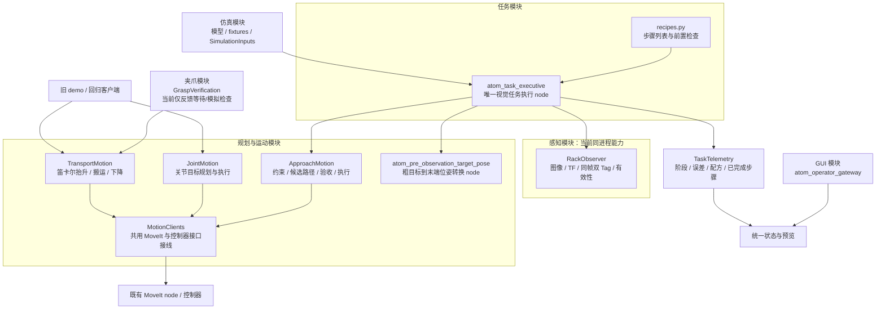

# 模块、node 与任务组合：本次重构后的结构

2026-09-30，分支 `refactor/modular-task-composition`。这是本次已实施的代码结构；与完整试管取放、硬件能力的实现范围分别判断。

## 开发规则

先确定功能属于哪个模块，再检查已有能力和 node 能否组合完成。能通过组合/参数实现时，增加任务配方或适配调用，不复制完整流程 node。新增 node 必须说明已有组合不足的原因，以及独立生命周期、持续数据源、故障隔离、硬件接口或部署边界的必要性。一个模块可以有多个 node，但一个函数或任务步骤不自动对应一个 node。

这条规则来自本次项目重构要求，记录在 DECISIONS 中。新增 package 也不是拆模块的前提；当前仍为 5 个 ATOM 自有 ROS package。

## 结构与 node 归属



这里的模块框不是额外 node：感知、运动和 telemetry 能力以普通 Python 类混入同一执行 node，共享该 node 的参数、TF、状态及 ROS 客户端。没有在此次重构中新增多个跨进程感知/规划 RPC 服务。

- `atom_task_executive` **替换**原 `atom_pre_observation_demo` 的运行角色，不与其同时启动。
- `pre_observation_demo` 可执行名称保留为兼容入口，直接转入同一个 TaskExecutive，不再保留原完整实现副本。
- `pre_observation_target_pose` 保留原独立 node；MoveIt、控制器、桥接、TF node 保留。
- 旧 `trajectory_demo` / `transfer_demo` 保留为基线与回归客户端，其运动算法移到规划模块，复用 MotionClients 接线。
- `tools/operator_gui/safety/sim_supervisor.py` 仍是独立固定 Observe 控制演示（原入口为兼容包装）：支持取消/停止/复位。它与默认视觉执行器尚未统一任务 Action；这是明确保留的接口迁移边界，不代表视觉任务已经支持网页控制/急停。

## 实际目录

```text
atom_xarm_sim/
  geometry.py                  公共几何与原有仿真常量
  perception/observer.py       RackObserver 能力
  planning/
    clients.py                 MoveIt/控制器客户端共用接线
    approach.py                ApproachMotion
    joint.py                   JointMotion
    transport.py               TransportMotion
    trajectory_support.py      原关节基线常量
    transfer_support.py        原搬运几何/配置辅助
  gripper/verification.py      GraspVerification；没有实现物理抓取
  simulation/inputs.py         SimulationInputs；仿真真值与粗输入
  telemetry/task_status.py     TaskTelemetry
  tasks/
    recipes.py                 无 ROS 依赖的组合引擎和配方
    executive.py               视觉任务 node 与配方能力实现
  pre_observation_demo.py       兼容入口，无第二套流程实现
  trajectory_demo.py           旧关节基线客户端/监测/报告
  transfer_demo.py             旧搬运基线客户端/状态/报告
```

公共运动接线 `MotionClients` 根据能力需要创建 MoveGroup、ExecuteTrajectory、IK/FK、CartesianPath、ListControllers 客户端。算法仍保留不同约束/验收策略，不把关节目标、视觉接近和搬运的物理语义强行合并。

## 两个任务复用相同能力

| 配方 | 步骤 |
| --- | --- |
| `visual_observe` | prepare_observation → move_observation → capture_observation |
| `visual_approach` | 同样三个步骤 → prepare_approach → align_selected → approach_selected |

任务执行引擎先检查配方名称和**所有**步骤是否存在，再允许任何步骤运行。失败立即终止后续步骤；已完成步骤保存在任务状态/报告中。视觉步骤中的原有新鲜度、几何限值、规划路径验收与有限重新对齐规则保持不变。

任务编排调用能力模块，不直接向关节控制器发命令。新增已有能力的组合放进配方，现有任务 node 继续执行；缺失的能力需先实现/验收，不能用状态字符串或模拟成功填补。

```bash
# 同一个 node，观察后停止
./scripts/atom.sh sim --camera rgb --recipe visual_observe --restart
# 同一个 node，观察后继续对齐/接近
./scripts/atom.sh sim --camera depth --recipe visual_approach --restart
```

GUI 状态新增 `executor`、`task_recipe`、`completed_capabilities`；观察配方的页面不显示未执行的对齐/接近为已完成。原 Topic/API 契约和只读权限保持兼容。

## 保留边界与后续工作

物理取放未由本次重构实现。夹爪反馈模块保留原模拟/外部信号等待语义，尚无接触、持有、随动或释放验收。旧固定搬运不作为当前试管槽的正确取放任务。

默认视觉执行器仍由脚本启动并运行指定配方，GUI 只读。未来统一 Action server、运动所有权与视觉任务取消/软件停止需要独立集成与验收；现有 Observe supervisor 不可被描述为视觉任务安全监督器。

同进程能力当前共享宿主 node 的运行上下文。后续按需要为边界引入显式数据结构/跨 node 契约，但不得为了“原子化”增加大量只有函数转发作用的 node。

验证结果和各测试命令见 [重构回归报告](REFACTOR_TEST_REPORT.md)。


## ESP32 gripper integration (2026-10-03)

Add reusable gripper/control.py capability in the existing task executive and the gripper_position_check / visual_approach_gripper_open recipes. The standalone position recipe has no arm motion. Both require explicit real-gripper opt-in/system clock; combined arm recipe additionally defaults to blocked pending physical arm/supervisor verification. The new hardware_bridge is a justified hardware runtime boundary replacing sensor-only serial ownership, not a task-specific node. ControlLease spans multiple Action goals, preventing manual UI/task competition; STOP/DISARM may interrupt. Force/grasp control remains a separate calibration/verification capability, never substituted by position completion. Architecture, startup and TODO acceptance: [GRIPPER_SYSTEM_INTEGRATION](GRIPPER_SYSTEM_INTEGRATION.md).
