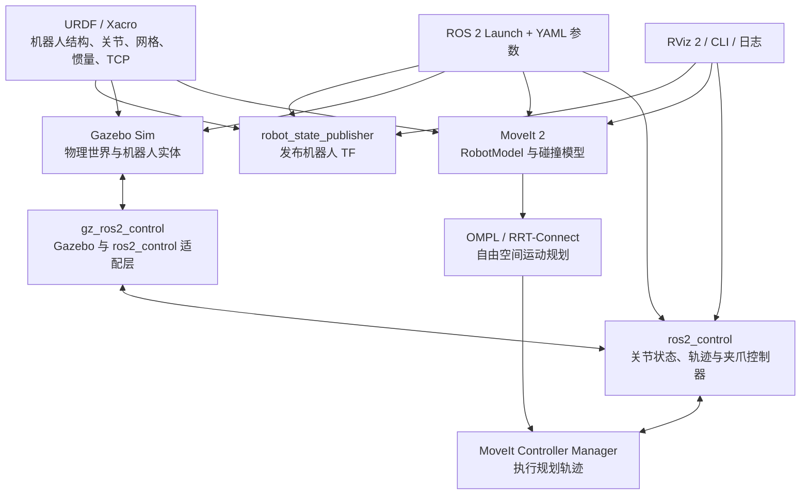

# 第一阶段：机械臂与夹爪 Gazebo 仿真的最小技术栈与学习路线

> 适用范围：Project ATOM 第一阶段数字样机与操作仿真  
> 当前状态：学习与实施计划，不代表相关功能已经完成  
> 目标：用尽可能小的知识集合，跑通“机械臂 + 双指夹爪 + Gazebo + MoveIt 2”的完整软件链路

## 1. 第一阶段到底要完成什么

第一阶段不是学习 ROS 2 的全部内容，也不是立即实现真实夹爪驱动、视觉识别、移动导航或实验室完整自动化。

本阶段只解决一个清晰问题：

> 能否从一个命令启动组合机器人，在 Gazebo 中稳定显示机械臂和夹爪，通过 ROS 2 控制机械臂关节与夹爪开合，并使用 MoveIt 2 规划和执行一段无碰运动，最终完成一个最小抓取—搬运—释放演示？

### 1.1 完成定义（Definition of Done）

满足下列条件，才算“跑通机械臂加夹爪仿真”：

- [ ] 一个命令可以启动 Gazebo、机器人模型、控制器、MoveIt 2 和 RViz 2。
- [ ] 组合机器人由“厂商机械臂描述 + 项目夹爪描述 + 顶层组合 Xacro”构成，不是从 CAD 导出的单体 URDF。
- [ ] `robot_state_publisher` 能发布完整且无冲突的 TF 树。
- [ ] Gazebo 启动、静置和运动时没有 NaN、模型爆炸、持续抖动或异常下落。
- [ ] `joint_state_broadcaster` 正常发布全部受控关节状态。
- [ ] 机械臂能够通过 `joint_trajectory_controller` 执行一条关节轨迹。
- [ ] 夹爪能够通过平行夹爪控制器或位置控制器执行张开与闭合。
- [ ] MoveIt 2 中的机器人、SRDF、碰撞模型、规划组和控制器配置一致。
- [ ] MoveIt 2 能规划并在 Gazebo 中执行至少三组无碰目标位姿。
- [ ] 已定义并验证 `tool0`、`gripper_mount`、`gripper_base_link` 和 `gripper_tcp`。
- [ ] 能完成一个最小抓取—搬运—释放演示；第一版允许采用逻辑 attach/detach，不要求先解决高保真接触抓取。
- [ ] 不可达目标、规划失败或控制器未启动时，程序能够失败退出并给出可读错误，而不是一直等待。
- [ ] 有最小 smoke test 和复现说明，另一名组员可以在干净终端中重现演示。

## 2. 系统链路：每个技术栈在做什么



如果这条链路中任意一层没有理解，常见现象就是“模型能看到但不能动”“Gazebo 能动但 MoveIt 不执行”“RViz 姿态和 Gazebo 不一致”或“夹爪控制器找不到关节”。

## 3. 第一阶段技术栈

| 层级 | 技术/工具 | 本项目中的作用 | 掌握深度 |
|---|---|---|---|
| 操作系统 | Ubuntu Linux | ROS 2、Gazebo 和 MoveIt 的主要开发环境 | 必须会基本终端、路径、权限和环境变量 |
| 版本管理 | Git、Git LFS | 管理源码以及网格、CAD、PDF 等二进制资产 | 必须会日常分支、提交、差异和 LFS 拉取 |
| 构建系统 | `colcon`、`ament_cmake`、`package.xml` | 构建和组织 ROS 2 工作空间 | 必须掌握 |
| 中间件 | ROS 2 | 节点通信、参数、Action、TF、启动和工具链 | 必须掌握下文列出的最小子集 |
| 机器人描述 | URDF、Xacro | 描述机械臂、夹爪、关节、碰撞、惯量和安装关系 | 必须掌握 |
| 坐标系统 | TF2 | 维护 base、机械臂、末端、夹爪和目标物体坐标关系 | 必须掌握 |
| 可视化 | RViz 2 | 检查模型、TF、PlanningScene 和规划轨迹 | 必须会使用和排错 |
| 仿真器 | Gazebo Sim | 运行物理世界、碰撞、重力和传感/执行接口 | 必须会模型加载、启动和基本调试 |
| 控制框架 | `ros2_control` | 把上层轨迹命令映射为关节命令 | 必须掌握配置关系 |
| 仿真适配 | `gz_ros2_control` | 把 Gazebo 关节连接到 `ros2_control` | 必须会配置，不要求阅读源码 |
| 控制器 | `joint_state_broadcaster`、`joint_trajectory_controller`、夹爪控制器 | 发布状态并控制机械臂和夹爪 | 必须会配置、启动和检查状态 |
| 运动规划 | MoveIt 2、OMPL、RRT-Connect | 建模规划组、检查碰撞、规划和执行机械臂运动 | 必须掌握基本工作流 |
| 配置文件 | YAML、XML、Python Launch | 配置控制器、MoveIt、Gazebo 和一键启动 | 必须掌握常用语法 |
| 编程语言 | Python 或 C++ | 编写最小任务节点、测试和启动逻辑 | 至少熟练一种；第一阶段可优先 Python |
| 测试与诊断 | `ros2` CLI、日志、`rosbag2`、`launch_testing`/pytest | 观察系统状态并建立 smoke test | CLI 和日志必须；自动测试掌握基础 |

### 3.1 版本选择边界

机械臂型号和厂商支持矩阵尚未最终确认，因此本文不把某个 Ubuntu、ROS 2、Gazebo 或 MoveIt 版本写成已经确定的项目事实。正式安装前应：

1. 确认机械臂型号和厂商 ROS 2 驱动支持范围；
2. 选择互相兼容的 Ubuntu、ROS 2、Gazebo 和 MoveIt 2 组合；
3. 在 `docs/DECISIONS.md` 记录选择依据和版本；
4. 锁定依赖后再编写安装脚本和 CI 环境。

在版本未冻结前，学习重点应放在稳定概念和配置关系上，而不是背诵某个发行版的命令细节。

## 4. ROS 2 中必须掌握的最小模块

### 4.1 必须真正掌握

#### A. 工作空间、包与构建

需要理解：

- ROS 2 workspace 的 `src/`、`build/`、`install/`、`log/`；
- `package.xml` 声明运行和构建依赖；
- `CMakeLists.txt` 或 Python 包配置负责安装目标和资源；
- `colcon build --symlink-install` 的作用；
- 每个新终端为什么需要 source ROS 环境和工作空间环境；
- overlay workspace 与依赖包查找顺序。

最小实操：新建一个包，构建成功，在新终端 source 后能被 `ros2 pkg list` 找到。

#### B. Node、Topic、Service、Action 的职责

不要求背所有 API，但必须知道如何选：

- **Topic**：持续发布的状态流，例如 `/joint_states`；
- **Service**：短时请求—响应，例如查询或切换配置；
- **Action**：耗时、可反馈、可取消的任务，例如执行机械臂轨迹或夹爪动作；
- **Node**：拥有发布、订阅、服务、Action、参数和定时器的运行单元。

机械臂轨迹不能简单理解为“向一个 topic 发一次消息”。本阶段必须理解 `FollowJointTrajectory` Action 的目标、反馈、结果和取消语义。

最小实操：使用 CLI 查看节点图、topic 类型、Action 服务端，并发送一条可观察结果的测试命令。

#### C. 参数与 YAML

需要理解：

- 参数属于哪个节点；
- YAML 中节点名、`ros__parameters` 和命名空间如何对应；
- 参数文件为什么“加载成功”仍可能没有作用；
- 控制器名称、关节名称和 MoveIt 配置为什么必须完全一致。

最小实操：通过 YAML 修改一个控制器参数，启动后用 CLI 读取并证明参数已生效。

#### D. Launch 系统

需要掌握：

- Python Launch 文件的 `Node`、`IncludeLaunchDescription` 和 launch argument；
- 如何把机器人描述、Gazebo、控制器和 MoveIt 拆成多个可组合 launch；
- 如何控制启动顺序，避免控制器在机器人实体生成前加载；
- 如何把世界文件、模型参数和 `use_sim_time` 暴露为参数。

最小实操：一个顶层 launch 启动机器人描述、Gazebo 和控制器；退出时所有子进程能够正常结束。

#### E. TF2 与机器人坐标系

这是第一阶段最容易被低估、但必须掌握的部分。

需要理解：

- frame、transform、parent/child 的含义；
- 静态 TF 与关节产生的动态 TF；
- `map`、`odom`、`base_link` 在本阶段可以简化到什么程度；
- `arm_base`、`tool0`、`gripper_mount`、`gripper_base_link`、`gripper_tcp` 的区别；
- 时间戳、坐标系名称和重复 TF 发布者导致的问题；
- 如何查看 TF 树和查询两个 frame 之间的变换。

最小实操：证明从机器人基座到 `gripper_tcp` 的 TF 连通，并用一组已知安装尺寸检查数值。

#### F. ROS 2 命令行诊断

至少熟练使用以下类别的命令：

```bash
ros2 pkg list
ros2 node list
ros2 node info <node>
ros2 topic list
ros2 topic info <topic>
ros2 topic echo <topic>
ros2 service list
ros2 action list
ros2 action info <action>
ros2 param list
ros2 param get <node> <parameter>
ros2 interface show <interface>
ros2 control list_controllers
ros2 control list_hardware_interfaces
ros2 launch <package> <launch_file>
```

重点不是背命令，而是能回答：哪个节点应该存在、哪个接口应该存在、数据类型是什么、消息是否在更新、控制器是否 active。

### 4.2 理解概念、会查资料即可

- QoS 的 reliability、durability、history：知道不兼容会导致“能看到 topic 名但收不到数据”。
- ROS Domain ID：知道多组机器人或多名同学同网段时需要隔离。
- Namespace 和 remapping：会避免多个机器人或控制器命名冲突。
- `use_sim_time`：知道仿真节点必须使用一致时钟。
- Component、Lifecycle Node：知道用途，本阶段不要求自行实现完整生命周期架构。
- `rosbag2`：会录制和回放关键 topic，本阶段不要求设计复杂数据管线。

### 4.3 第一阶段可以暂缓

- DDS 实现内部、发现协议和网络调优；
- 自定义 QoS 策略优化；
- 多机 ROS 2 网络和云端部署；
- micro-ROS、STM32 串口和真实伺服协议；
- Nav2、SLAM、AMCL、Hybrid A* 和移动底盘控制；
- 相机驱动、AprilTag、点云和视觉伺服；
- Behavior Tree、强化学习、模仿学习和无标记姿态估计；
- 实机阻抗控制、力控和安全 PLC。

这些内容不是不重要，而是不在“机械臂 + 夹爪最小 Gazebo 仿真”的关键路径上。

## 5. 机器人模型必须掌握的内容

### 5.1 URDF/Xacro

必须理解以下对象：

- `link`：刚体；
- `joint`：刚体之间的运动或固定关系；
- `origin xyz/rpy`：相邻坐标系变换；
- `axis`：关节运动方向；
- `limit`：位置、速度和力/力矩限制；
- `visual`：显示模型；
- `collision`：碰撞模型；
- `inertial`：质量、质心和惯量；
- Xacro property、macro、参数和文件 include；
- `ros2_control` 中关节 command/state interface 的声明。

项目建模原则：

```text
vendor_arm.xacro
        |
        | fixed joint: arm_to_gripper
        v
atom_gripper.xacro
        |
        +-- gripper_base_link
        +-- left_finger_link  -- prismatic joint
        +-- right_finger_link -- prismatic/mimic joint
        `-- gripper_tcp
```

夹爪和机械臂必须保持模块化。`gripper_mount` 表示机械安装基准，`gripper_tcp` 表示操作规划使用的工具中心点，两者不得混用。

### 5.2 网格、碰撞与惯量

必须掌握的工程常识：

- CAD 单位必须转换为 SI 单位；
- visual mesh 可以较详细，collision mesh 必须简化；
- 不能用零质量或明显错误的惯量“让模型先跑”；
- link 原点、网格原点和关节轴必须分别检查；
- 左右手指的移动方向和行程需要通过数值测试验证；
- mimic joint 在描述、仿真控制器和 MoveIt 中的支持方式需要保持一致。

最小实操：先在 RViz 中验证模型，再进入 Gazebo。不要同时调坐标、碰撞、惯量和控制器。

## 6. Gazebo 与 ros2_control 必须掌握的内容

### 6.1 Gazebo 最小知识

需要掌握：

- world、model、link、joint、plugin 的关系；
- URDF 如何被生成并加入 Gazebo；
- 重力、碰撞、摩擦和仿真时间的基本意义；
- 如何区分“描述模型错误”和“物理参数错误”；
- 如何检查实体、关节状态和仿真是否暂停；
- 为什么真实抓取的摩擦接触可能不稳定。

第一版抓放任务允许采用逻辑 attach/detach。它用于验证任务链、MoveIt 和故障处理，不得被描述为真实接触抓取已经验证。

### 6.2 ros2_control 最小知识

需要理解四层关系：

1. URDF/Xacro 声明哪些关节具有 command/state interface；
2. `gz_ros2_control` 为这些接口提供仿真硬件后端；
3. `controller_manager` 加载和管理控制器；
4. MoveIt 或测试程序通过 Action/Topic 向控制器发命令。

必须会检查：

- hardware interface 是否存在；
- controller 是 `unconfigured`、`inactive` 还是 `active`；
- 机械臂控制器的关节顺序是否正确；
- MoveIt 配置的控制器名和 Action namespace 是否一致；
- 夹爪使用一个主关节还是两个独立关节；
- `joint_states` 是否持续更新且单位正确。

## 7. MoveIt 2 必须掌握的内容

### 7.1 必须掌握

- URDF 与 SRDF 的分工；
- planning group、end effector、virtual joint 和 named state；
- self-collision matrix 的作用；
- PlanningScene 中机器人状态、环境物体和碰撞物体；
- OMPL 规划管线的基本输入与输出；
- RRT-Connect 作为第一版自由空间规划基线的定位；
- 规划成功和轨迹执行成功是两个不同阶段；
- MoveIt 如何把轨迹交给 `joint_trajectory_controller`；
- 如何设置速度/加速度缩放，并在仿真中保守执行；
- 如何判断失败来自 IK、碰撞、规划器、控制器还是超时。

### 7.2 第一阶段最小规划策略

- 自由空间：MoveIt 2 + OMPL + RRT-Connect；
- 最后接近与撤离：先使用简单 Cartesian path 或受约束直线段；
- 夹爪开合：独立 Action，不把夹爪开度混进机械臂轨迹；
- 任务编排：第一版可用一个清晰的 Python/C++ 状态流程；
- MoveIt Task Constructor：基本抓放完成后再引入，不作为最初几天的学习阻塞项。

本阶段不需要证明 RRT-Connect 是“最佳算法”。它只是成熟、快速、适合建立可复现自由空间基线的起点。

## 8. 推荐的最小学习顺序

原则是每学一个模块，就必须产生一个可运行的小结果。不要先连续看几周课程再开始集成。

### L0：Linux、Git 与环境基础

**学习内容**

- 终端、目录、环境变量、进程、权限；
- Git 状态、差异、分支、提交；
- ROS 环境与工作空间 source 顺序。

**最小练习**

- 克隆或打开项目；
- 创建测试分支；
- 构建一个空工作空间；
- 在两个新终端中正确加载环境。

**通过条件**

- 能解释“命令找不到包”究竟是没构建、没安装、没 source，还是依赖缺失。

### L1：ROS 2 通信与 CLI

**学习内容**

- Node、Topic、Service、Action、Parameter；
- ROS 2 CLI 和接口类型。

**最小练习**

- 运行官方或本地最小 publisher/subscriber；
- 使用 CLI 观察消息；
- 发送一个 Action goal 并取消一次。

**通过条件**

- 不看图形界面，也能通过 CLI 判断一个节点和接口是否工作。

### L2：Launch、参数与包结构

**学习内容**

- Python Launch；
- YAML 参数；
- 包的安装目录与资源查找。

**最小练习**

- 用一个 launch 同时启动两个节点；
- 通过 launch argument 切换参数文件；
- 证明参数已加载到正确节点。

**通过条件**

- 不需要手工打开多个终端启动同一个最小系统。

### L3：URDF/Xacro、RViz 与 TF2

**学习内容**

- link、joint、origin、axis、limit；
- visual/collision/inertial；
- Xacro 模块化；
- robot_state_publisher 与 TF2。

**最小练习**

1. 用简单几何体建立两关节测试机器人；
2. 在 RViz 中显示模型；
3. 发布关节状态并观察 TF 变化；
4. 查询基座到末端的 transform。

**通过条件**

- 能独立定位“关节绕错轴、网格偏移、TF 断开、重复发布”的原因。

### L4：夹爪单体模型

**学习内容**

- CAD 网格导出与单位检查；
- 双指 prismatic joint；
- mimic 或对称控制；
- TCP 和安装法兰。

**最小练习**

- 夹爪在 RViz 中正确显示；
- 手指能够对称开合；
- 开度范围和 TCP 位置通过已知尺寸检查。

**通过条件**

- 夹爪描述包不依赖具体机械臂，也能单独启动和检查。

### L5：Gazebo 基础

**学习内容**

- world、实体生成、重力、碰撞和惯量；
- 仿真时钟和基本诊断。

**最小练习**

- 把两关节测试机器人加入空世界；
- 启动后静置一段时间；
- 检查模型没有爆炸、穿透或异常漂移。

**通过条件**

- 可以分别判断视觉模型问题、碰撞模型问题和惯量问题。

### L6：ros2_control 与 Gazebo 对接

**学习内容**

- hardware interface；
- controller manager；
- joint state broadcaster；
- trajectory controller 和夹爪控制器；
- `gz_ros2_control`。

**最小练习**

1. 控制测试机器人执行一条关节轨迹；
2. 列出 active controllers；
3. 让夹爪完成张开、半闭合和闭合三种状态。

**通过条件**

- 能从 URDF、控制器 YAML、Action 名称和关节顺序四处交叉检查配置。

### L7：组合机械臂与夹爪

**学习内容**

- Xacro include 和顶层组合；
- 固定安装关节；
- 碰撞与 TF 树检查。

**最小练习**

- 引用厂商机械臂描述；
- 安装项目夹爪；
- 在 RViz 和 Gazebo 中同时验证；
- 分别执行机械臂轨迹和夹爪命令。

**通过条件**

- 更换夹爪安装变换时不需要修改厂商机械臂包。

### L8：MoveIt 2 规划与执行

**学习内容**

- SRDF、规划组、末端执行器、自碰撞矩阵；
- PlanningScene、IK、OMPL 和控制器映射。

**最小练习**

1. 在 RViz 中拖动交互标记规划；
2. 在 Gazebo 中执行规划轨迹；
3. 加入一个碰撞物体并证明规划绕开；
4. 请求一个不可达目标并正确处理失败。

**通过条件**

- 能区分规划失败和执行失败，并通过日志定位所属层级。

### L9：最小抓放任务与自动验收

**学习内容**

- 预抓取、接近、闭合、搬运、释放、撤离的任务状态；
- 逻辑 attach/detach；
- 超时、取消和失败码；
- smoke test 与结果记录。

**最小练习**

- 从固定源位置抓取简单物体并放到固定目标位置；
- 连续执行多次；
- 保存每次规划结果、执行结果、周期时间和失败类型。

**通过条件**

- 一名没有参与开发的组员能根据 README 一键复现实验。

## 9. 学习优先级总表

| 主题 | 优先级 | 第一阶段要求 |
|---|---:|---|
| ROS 2 workspace/package/colcon | P0 | 必须独立构建和排错 |
| Node/Topic/Service/Action | P0 | 必须理解职责，尤其是 Action |
| ROS 2 参数、YAML、Launch | P0 | 必须能够组合系统并检查参数 |
| TF2 | P0 | 必须能够设计、查询和排错 TF 树 |
| URDF/Xacro | P0 | 必须能建立模块化组合机器人 |
| RViz 2 | P0 | 必须能检查模型、TF、碰撞和规划 |
| Gazebo 基本物理与模型加载 | P0 | 必须能判断模型稳定性 |
| ros2_control/gz_ros2_control | P0 | 必须能配置和激活控制器 |
| MoveIt 2 基本规划与执行 | P0 | 必须能规划、执行和区分失败层级 |
| Python 或 C++ ROS 2 节点 | P1 | 至少掌握一种，用于任务和测试 |
| rosbag2 与自动测试 | P1 | 会基础记录并建立 smoke test |
| MoveIt Task Constructor | P2 | 基本抓放后学习 |
| Pilz LIN/PTP | P2 | 需要严格直线接近时加入 |
| Gazebo 高保真接触参数 | P2 | 逻辑抓取基线完成后再研究 |
| 相机、AprilTag、视觉伺服 | 暂缓 | 第二阶段内容 |
| Nav2、SLAM、Hybrid A* | 暂缓 | 移动底盘阶段内容 |
| STM32、micro-ROS、真实驱动 | 暂缓 | 硬件接口确认后开展 |
| 强化学习/模仿学习 | 暂缓 | 只有模型基线出现明确瓶颈时考虑 |

## 10. 建议的软件包结构

第一阶段建议保持下列职责边界：

```text
ros2_ws/src/
|-- atom_gripper_description/  # 夹爪 Xacro、网格、RViz 检查
|-- atom_robot_description/    # 顶层组合 Xacro 与安装变换
|-- atom_simulation/           # Gazebo world、插件、控制器与仿真 launch
|-- atom_moveit_config/        # SRDF、运动学、规划器和执行控制器配置
|-- atom_task_control/         # 最小抓放流程、超时和失败处理
|-- atom_bringup/              # 一键启动入口
|-- atom_tests/                # Xacro、TF、控制器和 smoke tests
`-- atom_interfaces/           # 只有确实需要自定义接口时才建立
```

不要把所有文件放进一个“大包”。description、simulation、MoveIt、task 和 bringup 的变化原因不同，拆开后更容易替换机械臂和未来移动底盘。

## 11. 推荐实施顺序与依赖关系

```text
冻结版本和机械臂来源
        |
        v
夹爪 Xacro 单体 -----> RViz + TF 验证
        |                    |
        v                    v
简化碰撞与惯量 -----> Gazebo 稳定性
        |                    |
        +---------> ros2_control 单体开合
                             |
厂商机械臂描述 --------------+
        |
        v
顶层组合 Xacro -> 组合 TF/碰撞 -> 机械臂和夹爪分别可控
        |
        v
MoveIt 2 配置 -> 规划 -> Gazebo 执行
        |
        v
最小抓放任务 -> 故障测试 -> 一键启动与复现文档
```

严格按这个顺序能减少同时调试多个层级的情况。特别是：在 RViz 中没有验证通过的 URDF，不应直接拿到 Gazebo 中调物理；控制器没有单独验证通过时，不应先调 MoveIt。

## 12. 常见误区

### 误区 1：模型显示出来就说明 URDF 正确

RViz 能显示 visual mesh，不代表碰撞、惯量、关节轴、TCP 或控制接口正确。必须分别验证。

### 误区 2：Gazebo 中能动就说明 MoveIt 已经接好

Gazebo 可以接受控制器命令，但 MoveIt 还可能使用错误的规划组、关节顺序、控制器名或 Action namespace。

### 误区 3：把所有坐标偏差都用一个 fixed joint 修掉

这会混淆 CAD 原点、安装法兰、工具基准和 TCP。每个 frame 必须对应真实、可解释的物理含义。

### 误区 4：先用复杂接触参数追求“真实抓取”

接触抓取可能被摩擦、时间步长和求解器参数拖慢。应先用逻辑 attach 建立任务基线，再把物理抓取作为单独实验。

### 误区 5：一开始就学习 Nav2、视觉和强化学习

这些模块不会解决 URDF、TF、控制器或 MoveIt 配置错误，反而会扩大调试范围。

### 误区 6：复制厂商模型并直接修改

应引用厂商包，并在项目顶层 Xacro 中加入安装关系。否则厂商更新、机械臂替换和许可证追踪都会变困难。

## 13. 每名组员应具备的最低能力

所有参与第一阶段集成的成员至少应能：

1. 从干净终端构建并启动工作空间；
2. 用 ROS 2 CLI 判断节点、topic、Action、参数和控制器状态；
3. 阅读基本 URDF/Xacro、Launch 和 YAML；
4. 查看 TF 树并查询两个 frame 的变换；
5. 在 RViz 中检查 RobotModel 和 PlanningScene；
6. 判断故障属于模型、Gazebo、控制器、MoveIt 还是任务节点；
7. 提交可复现的错误报告，包括命令、日志、版本和触发步骤。

建议再明确两类负责人：

- **模型与控制负责人**：深入掌握 CAD→mesh、URDF/Xacro、惯量、Gazebo 和 ros2_control；
- **规划与任务负责人**：深入掌握 MoveIt 2、PlanningScene、轨迹执行和任务故障处理。

两类负责人必须共同掌握 TF2 和控制器接口，避免系统边界无人负责。

## 14. 第一阶段学习完成后的自测问题

如果以下问题不能清楚回答，说明对应模块还没有真正掌握：

1. `robot_state_publisher` 使用什么数据生成 TF？
2. `/joint_states` 是命令还是状态？由谁发布？
3. 为什么机械臂轨迹适合使用 Action，而不是普通 Service？
4. `tool0`、安装法兰和 `gripper_tcp` 有什么区别？
5. visual mesh 正确但 collision mesh 偏移时会出现什么现象？
6. Gazebo 中模型抖动时，应优先检查哪些参数？
7. `ros2_control` 的 hardware interface、controller manager 和 controller 分别负责什么？
8. 控制器显示 active，但 MoveIt 不执行轨迹时应检查哪些映射？
9. URDF 与 SRDF 分别描述什么？
10. MoveIt 规划失败与轨迹执行失败如何区分？
11. 为什么第一版抓取允许逻辑 attach，但报告中必须注明证据边界？
12. 如果更换机械臂，哪些包应该变化，哪些夹爪文件不应变化？

## 15. 本阶段明确不做的事情

为防止范围不断扩大，第一阶段默认不包含：

- 真实 STM32、舵机、磁传感器或串口驱动；
- 真实 Opentrons Flex 和 DynaPro NanoStar 的尺寸与插入验证；
- 相机定位、AprilTag、视觉伺服或无标记识别；
- 移动底盘、SLAM、Nav2、停靠或 Hybrid A*；
- 高保真柔性硅胶仿真；
- 强化学习或端到端学习控制；
- 实机安全认证或硬件急停实现。

这些内容将在机械臂与夹爪仿真基线稳定后，依据真实误差和硬件条件逐项启动。

## 16. 第一阶段最终应交付的文件

- 夹爪 URDF/Xacro、视觉网格和简化碰撞网格；
- 机械臂与夹爪顶层组合 Xacro；
- Gazebo world、生成脚本和 `gz_ros2_control` 配置；
- 机械臂和夹爪控制器 YAML；
- MoveIt 2 SRDF、运动学、规划器和控制器配置；
- 最小抓放任务节点；
- 一键 bringup launch；
- Xacro、TF、控制器和任务 smoke tests；
- 版本、运行方法、已知限制和故障排查文档；
- 一组可重复的演示日志和结果记录。

完成这些交付物后，项目才进入感知引导、真实硬件和移动操作集成阶段。
