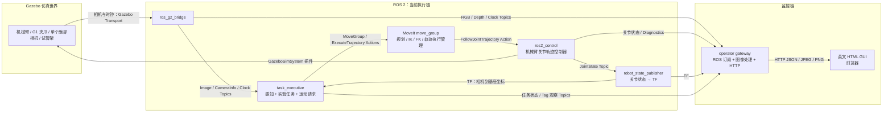
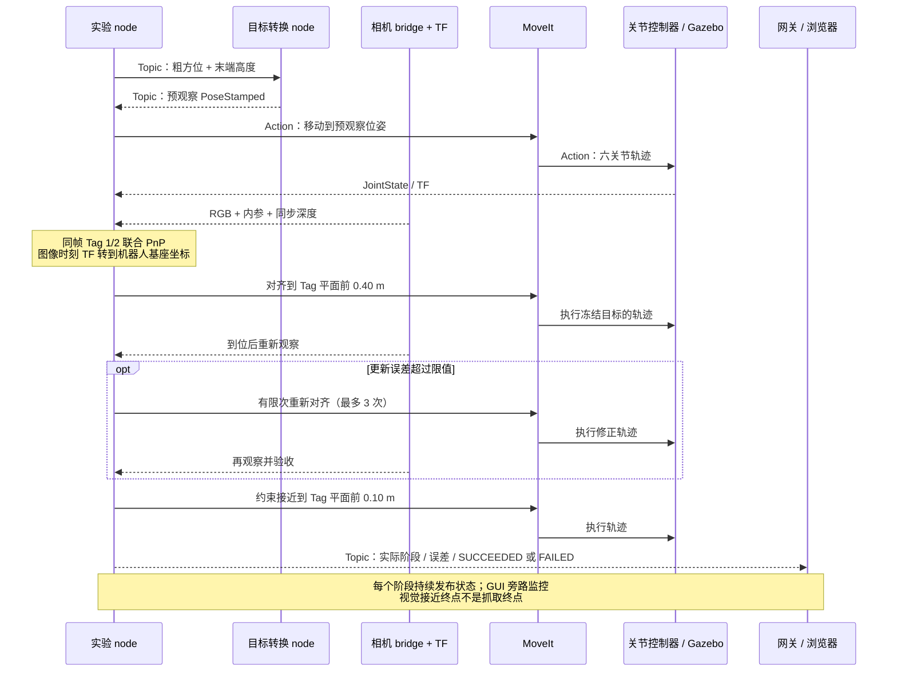
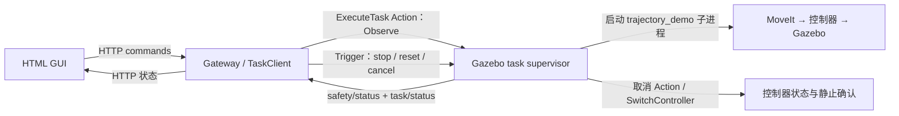
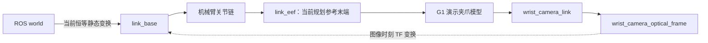

# ATOM 当前实现架构：从相机到运动，再到 GUI

更新：2026-09-30。本文描述当前工作区代码，包含尚未提交的 GUI、脚本整合及双 Tag 对齐修改。以默认命令 `./scripts/atom.sh sim --camera depth` 为主线；其他运行模式单独说明。原有未来架构规划移到 [架构 roadmap](SYSTEM_ARCHITECTURE_ROADMAP.md)。

## 1. 先看全貌

现在运行的是：**Gazebo 模拟机器人与相机 → ROS 2 传感器数据 → Tag 定位与视觉接近 → MoveIt 规划 → 关节控制器执行 → GUI 观察反馈**。

目前已完成预观察、双 Tag 位姿估计、对齐、必要时重新对齐、接近到 Tag 平面前约 0.10 m。**实际夹住试管、带着试管运动、放进目标槽尚未完成。** GUI 在这个模式里只读，启动脚本自动运行实验，不是网页点击 Pick 启动实验。

这张图有两条不同的链：上面是实际控制闭环，右边是旁路监控。**GUI 的检测结果不会直接驱动机械臂。**

## 2. Package、Node、进程分别是什么？

| 概念 | 在本项目中的例子 | 理解方式 |
| --- | --- | --- |
| ROS package | `atom_xarm_sim` | 一组可构建、安装的代码/配置/资源；不是一个运行进程 |
| ROS node | `/atom_task_executive` | 运行后接收数据、计算或发出请求的参与者 |
| Launch 文件 | `uf850_arm_only.launch.py` | 组装配置并启动多个进程/node |
| Gazebo 插件 | `GazeboSimSystem` | 在仿真进程内部接入控制，不是独立 package 实例 |
| 普通模块 | `rack_pose.py` | 被 node 调用的函数；没有自己的 ROS node |
| 浏览器 / HTTP 服务 | HTML 页面、`server.py` | 浏览器不是 ROS node；网关进程内部创建了 ROS node |

因此不能把“有 5 个 package”理解成“运行 5 个 node”，也不能把每个 `.py` 都算成 node。

## 3. 当前有几个 package？

### ATOM 自有：5 个

| Package                                                                | 内容/职责                                           | 默认试管实验是否使用                       |
| ---------------------------------------------------------------------- | ----------------------------------------------- | -------------------------------- |
| [`atom_xarm_sim`](../ros2_ws/src/atom_xarm_sim/)                       | 启动 Gazebo/MoveIt、生成腕部相机与场景、8 个可执行入口（含兼容别名）、Tag 定位与接近 | **使用**，主实验 package               |
| [`atom_gripper_description`](../ros2_ws/src/atom_gripper_description/) | 继承的 ATOM 夹爪 Xacro、网格、CAD 提取工具及描述检查              | **不装到当前演示机器人上**；当前演示使用官方 G1      |
| [`atom_xarm_description`](../ros2_ws/src/atom_xarm_description/)       | 组合官方机械臂与 ATOM 自定义夹爪的模块化 Xacro                   | 当前默认 launch 未采用这条组合路径            |
| [`atom_xarm_dynamics`](../ros2_ws/src/atom_xarm_dynamics/)             | 可选名义执行器 C++ 插件 `NominalActuatorSystem` 与配置      | 默认不用；`demo dynamics` 启用          |
| [`atom_operator_interfaces`](../ros2_ws/src/atom_operator_interfaces/) | 定义 `ExecuteTask.action`，生成标准任务请求/反馈/结果类型        | 控制型 Observe 演示使用；默认试管模式没有它的任务服务端 |

GUI 代码在 [`tools/operator_gui/`](../tools/operator_gui/)，**还不是一个 ROS package**。它通过 `rclpy` 创建网关 node，但由 Python 直接启动。

### 官方源码核心依赖：8 个选定 package

构建入口选用 `uf_ros_lib`、`xarm_msgs`、`xarm_sdk`、`xarm_description`、`xarm_api`、`xarm_controller`、`xarm_gazebo`、`xarm_moveit_config`。

当前仿真主要使用官方模型、控制配置、Gazebo 资源和 MoveIt 配置。**构建了 `xarm_api` / SDK 不代表实机驱动已经运行或机械臂已经连接。** 此外还有通过系统安装的 ROS/MoveIt/TF/Gazebo 框架 package；“5 + 8”不是全部依赖总数。现有环境与版本依据见 [D-007 等既有决策](DECISIONS.md) 和 [Docker 说明](../docker/jazzy/README.md)。

## 4. 默认模式运行哪些 node？

2026-09-30 对运行中的深度模式做了约 4 s ROS 图发现采样。按下面的主要角色统计是 **13 个 ROS node 实例，其中 ATOM 自有逻辑 node 3 个**。图中还存在 MoveIt/TF 内部 node 和 CLI daemon，不能把其数量当作固定架构规模。

| 主要 node                             |  个数 | 来自哪里                                | 负责什么                                          |
| ----------------------------------- | --: | ----------------------------------- | --------------------------------------------- |
| `/atom_task_executive`        |   1 | `atom_xarm_sim`                     | 当前实验协调者：产生粗目标、处理相机、估计 Tag/架平面、请求规划与执行、验收、发布状态 |
| `/atom_pre_observation_target_pose` |   1 | `atom_xarm_sim`                     | 把粗高度/方位转换为预观察末端位姿                             |
| `/atom_operator_gateway`            |   1 | `tools/operator_gui/ros_adapter.py` | 订阅遥测、查询控制器和 TF、处理预览，供 HTTP 服务读取               |
| `/robot_state_publisher`            |   1 | ROS 框架                              | URDF + JointState → 动态/静态 TF                  |
| `/static_transform_publisher`       |   1 | TF 框架                               | 当前临时 `world → link_base` 恒等变换                 |
| `/ros_gz_bridge`                    |   2 | `ros_gz_bridge`                     | 分别桥接时钟、相机；当前两个实例同名，诊断时需注意                     |
| `/move_group`                       |   1 | MoveIt                              | 规划、运动学服务、执行管理                                 |
| `/controller_manager`               |   1 | ros2_control                        | 加载、查询、切换控制器                                   |
| `/gz_ros_control`                   |   1 | Gazebo 控制插件                         | 仿真硬件与 ros2_control 接入角色                       |
| `/joint_state_broadcaster`          |   1 | ROS 控制器                             | 发布机械臂和演示夹爪关节状态                                |
| `/uf850_traj_controller`            |   1 | JointTrajectoryController           | 执行六关节轨迹                                       |
| `/uf850_gripper_traj_controller`    |   1 | JointTrajectoryController           | 演示 G1 夹爪控制接口；存在不等于当前实验发出了抓取命令                 |

当前 ROS 图共发现 19 个条目：上面 13 个 + 5 个 MoveIt/TF 内部实例 + 1 个 CLI daemon。桥接实例同名，因此独立名称数与实例数不同。Gazebo 世界/传感器本身、浏览器、短暂的 spawn/spawner 进程不包含在此计数中。原始采样保存在 `tmp/operator_gui/architecture_snapshot.json`，是一次运行快照，不是永久数量承诺。

### 其他可执行 node：按模式启动，不能同时算进默认模式

| 可执行入口 / node | 使用场景 |
| --- | --- |
| `trajectory_demo` / `/uf850_arm_only_trajectory_demo` | 纯臂轨迹、相机固定观察演示；也由 Observe supervisor 作为子进程调用 |
| `smoke_test` / `/uf850_smoke_test` | 仿真基础验收 |
| `target_publisher` / `/target_publisher` | 发布旧固定取/放位姿 |
| `transfer_demo` / `/transfer_demo` | 旧固定目标抬升/搬运/下降，接受模拟抓取成功 |
| `camera_probe` / `/atom_camera_probe` | 独立相机探测/保存结果 |
| `sim_supervisor.py` / `/atom_gazebo_task_supervisor` | **仅控制型 Observe 模式**，任务 Action、软件停止/复位 |

## 5. 信息通过什么方式传递？

| 方式 | 用途 | 当前例子 |
| --- | --- | --- |
| ROS 2 Topic | 持续发布数据；一个发布者可被多个订阅者观察 | Image、JointState、任务状态 |
| ROS 2 Service | 一次请求、一次响应，适合查询或切换 | IK/FK、ListControllers、SwitchController |
| ROS 2 Action | 耗时操作，具有接受、反馈、结果和取消 | MoveGroup、ExecuteTrajectory、FollowJointTrajectory |
| TF | 带时间的坐标关系；底层通过 ROS Topics 分发 | 相机图像时刻的 camera → link_base |
| Gazebo Transport | 仿真内部消息系统；相机数据由 bridge 转入 ROS | 相机图像与仿真时钟 |
| 进程内函数/共享缓存 | 同一 node 或网关内的数据流 | `rack_pose.py`、`sensor_preview.py`；它们不是跨 node 接口 |
| HTTP | 浏览器与网关之间的数据/指令请求 | `/api/v1/state`、`/camera`、`/depth`、`/commands` |

ROS node 之间通过 ROS 2 中间件通信，不是 GUI HTTP。仿真、网关当前在 Docker host network 上，默认 `ROS_DOMAIN_ID=42`；配置要一致。不要让多个实验任务同时拥有机械臂命令权或同时发布同一任务状态。

### 当前关键 Topics

| Topic | 消息类型 | 发布者 → 订阅者 | 实际作用 |
| --- | --- | --- | --- |
| `/clock` | `rosgraph_msgs/Clock` | 时钟 bridge → 仿真时间 node/网关 | 统一仿真时间；暂停时钟不是正常运行 |
| `/joint_states` | `sensor_msgs/JointState` | joint_state_broadcaster → MoveIt、TF、实验、网关 | 实际模拟关节位置/速度 |
| `/tf`, `/tf_static` | `tf2_msgs/TFMessage` | 状态/静态 TF 发布者 → 实验、MoveIt、网关 | 坐标变换 |
| `/atom/wrist_camera/image` | `sensor_msgs/Image` | 相机 bridge → 实验、网关 | 深度模式中的 RGB 图 |
| `/atom/wrist_camera/depth_image` | `sensor_msgs/Image` | 相机 bridge → 实验、网关 | 深度模式中的深度图 |
| `/atom/wrist_camera/camera_info` | `sensor_msgs/CameraInfo` | 相机 bridge → 实验、网关 | 深度模式相机内参 |
| `/atom/pre_observation_target` | `geometry_msgs/PoseStamped` | 实验 node → target_pose node | 粗方位/高度命令；x/y 不参与目标生成 |
| `/atom/pre_observation_pose` | `geometry_msgs/PoseStamped` | target_pose node → 实验 node | 位于粗方位上、默认距基座 0.35 m 的 `link_eef` 目标 |
| `/atom/approach_task` | `std_msgs/String` 内含 JSON | 实验 node 暂时代发 → 自己接收 | 选 Tag ID 和 pick/place 名称；当前名称不代表物理取放已实现 |
| `/atom/approach/tag_observation` | `std_msgs/String` 内含 JSON | 实验 node → 网关/日志 | 被选 Tag 的时间戳、机器人坐标位姿及阶段 |
| `/atom/task/status` | `std_msgs/String`，schema v1 JSON | 当前实验 node → 网关 | 阶段、进度、失败原因、几何误差、终态心跳 |
| `/diagnostics` | `diagnostic_msgs/DiagnosticArray` | 控制系统 → 网关 | 控制诊断；不能据此宣称硬件安全 |

RGB-only 模式话题不同：RGB 为 `/atom/wrist_camera`，内参为 `/atom/camera_info`，没有 depth topic。两种模式分别加载配置，不是同时安装两台相机。

图像订阅采用 sensor-data QoS；粗目标/位姿和默认实验状态发布采用 reliable + transient-local 配置。网关主要使用 sensor-data 订阅，并依靠持续状态心跳更新；它不是持久化任务数据库。

### 当前关键 Services 与 Actions

| 接口 | 类型 | 谁调用谁 |
| --- | --- | --- |
| `/move_action` | `moveit_msgs/action/MoveGroup` | 实验 → MoveIt，规划/预观察运动 |
| `/execute_trajectory` | `moveit_msgs/action/ExecuteTrajectory` | 实验 → MoveIt，执行已验收轨迹 |
| `/compute_ik` / `/compute_fk` | `GetPositionIK` / `GetPositionFK` | 实验 → MoveIt，求解/检查位姿 |
| `/compute_cartesian_path` | `GetCartesianPath` | 实验 → MoveIt，笛卡尔路径候选 |
| `/controller_manager/list_controllers` | `ListControllers` | 实验/网关 → manager，查询就绪 |
| `/uf850_traj_controller/follow_joint_trajectory` | `control_msgs/action/FollowJointTrajectory` | MoveIt 执行管理 → arm controller |
| `/uf850_gripper_traj_controller/follow_joint_trajectory` | 同上 | 演示夹爪接口存在；当前接近实验未执行抓取闭合/放置 |

## 6. 一次视觉接近怎样协同？

当前由同一个 task executive node 组合感知、运动和状态能力；内部已按模块拆分，但没有新增独立 perception server。两个视觉任务复用同一套能力，详见 [模块与任务](MODULES_AND_TASKS.md)。`rack_pose.py` 是联合位姿估计函数，`camera_experiment.py` 是模型/场景生成函数，都不是额外 node。

粗方位现在由实验 node 根据已知仿真布置和随机方位误差产生；不是底盘定位的真实输出。控制用 Tag PnP 结果经图像时间戳 TF 转换；预定义仿真真实位姿另外用于报告比较。

轨迹执行期间收集观察，但每条轨迹的目标保持冻结；到段末重新观察再决定下一段。**当前不是连续视觉伺服，也不是边看边无限重规划。**

## 7. GUI 与运动的关系

网关一个进程中有：HTTP server、ROS executor 线程、数据缓存、JPEG/PNG 编码及独立 Tag 监控检测。`task_client.py` 是 Action 客户端模块，`sensor_preview.py` 是预览模块，均没有单独 node。

| 浏览器接口 | 返回/请求 | 当前用途 |
| --- | --- | --- |
| `GET /api/v1/state` | JSON | 关节、TF、控制器、任务、传感器、事件及数据新鲜度；约 1 Hz 页面刷新 |
| `GET /api/v1/camera` | JPEG/兼容 PNG | RGB 预览，页面独立最高约 10 Hz 请求 |
| `GET /api/v1/depth` | PNG | 深度伪彩预览；黑色是无效深度 |
| `GET /api/v1/map` | SVG | 本地地图静态可视化；不是在线 SLAM/导航 |
| `GET /api/v1/session` | token | 当前 HTTP 命令防伪请求机制；不是用户认证 |
| `POST /api/v1/commands` | JSON | 仅控制型模式有受门控的下游接口，默认试管模式禁用 |

当前 RGB-D 的 **目标定位仍采用 RGB 双 Tag PnP**。深度用于同步约束/质量统计/预览，还没融合为试管表面定位或规划场景占据图。透明管的全图深度质量也不能直接当作试管测量质量。

网关另做一次 Tag 检测只供显示；它与控制检测频率/采样时刻不同，读源时间戳才能判断是否同一帧。RGB/深度源配置 640×480、10 Hz 仿真时间；网关可配置预览上限默认 15 Hz 以容纳源时序抖动；监控 Tag 检测最高约 2 Hz。wall-clock 实际帧率受仿真运行速度影响。已有单次约 5 s 的 9.7 fps 接收/编码记录，不是所有负载下的保证，也不是浏览器/无线实测。

## 8. 三种模式不要混淆

| 命令 | 运动任务发布者 | GUI 能否发任务 | 验收范围 |
| --- | --- | --- | --- |
| `sim --camera depth` | `task_executive` | 只读 | Tag 视觉接近 |
| `sim --workflow transfer` | `transfer_demo` + 固定位姿 publisher | 只读 | 旧固定坐标机械臂运动，目标不对应当前试管槽；模拟抓取成功 |
| `observe --control` | Gazebo task supervisor | 支持 Observe/取消/软件停止/复位 | 固定关节观察往返，不是试管取放 |
| `attach --camera depth` | 不启动运动任务 | 只读 | 只加入现有 ROS 图监控 |

只有控制型 Observe 会启动下面这条命令链：

`ExecuteTask.action` 已定义 Observe/Pick/Place/Navigate 请求，以及反馈/结果/取消机制；目前该 supervisor 只实现 Observe。停止实现是 Gazebo 模式取消轨迹、停用臂控制器并检查模拟关节反馈，**不是硬件急停**，也未接入默认视觉接近 node 的完整任务管理。

## 9. 当前“看到名称，但没有接通”的接口

本次默认模式采样：以下 topic 的发布者数均为 **0**：`/odom`、`/battery_state`、`/atom/safety/status`、`/atom/wrist_camera/image/compressed`。原始图像预览直接在网关编码，因此 compressed topic 没发布者也可以正常显示 RGB。

`/atom/task/execute` 能被 ROS action list 看见，是因为网关创建了客户端；当前没有该 Action 的服务端/反馈状态发布者。**接口名存在 ≠ 有数据源或可执行服务。**

底盘状态/导航、真实机械臂驱动接线、硬件故障与停止、自定义夹爪抓取反馈、在线地图定位、深度场景更新和真实物体取放都还没有进入默认闭环。当前 `map/` 是离线地图资产，GUI 为静态展示。

## 10. TF 与部署边界

**Gazebo 世界坐标不能直接当作 ROS 的这个 world 坐标。** Gazebo 中机器人模型出生位置为 `[-0.2, -0.54, 1.021] m`、yaw `-1.571 rad`，而当前 ROS `world → link_base` 仍是恒等变换。实验报告代码显式换算仿真真值；旧固定运动目标不是当前试管槽坐标。后续需要统一 workstation/base/slot/TCP 标定；不能把试管中心坐标直接作为 `link_eef` 抓取目标。

当前运行布局是主机浏览器 → localhost HTTP:8089 → 一个 Docker 容器内的网关和 ROS/Gazebo。仓库挂载 `/workspace`，构建/安装/日志挂载到 `.docker-runtime/jazzy_ws/`，实验报告在 `tmp/operator_gui/workflow/run_*/`。

无线尚未测通。已有可用边界是机器人侧保留 ROS/网关，远端电脑通过经配置的网络访问 HTTP；当前网关仅监听 `127.0.0.1`，不是已经开放的 Wi-Fi 服务。ROS 跨主机还需另行验证 DDS 发现、网络与时钟配置。连接中断时的命令所有权、故障和硬件停止验证仍是实机迁移工作，不能由页面连接状态替代。

## 11. 看代码时从哪里进入？

1. [`scripts/atom.sh`](../scripts/atom.sh) → [`scripts/lib/operator.sh`](../scripts/lib/operator.sh)：选择启动模式、容器和实验进程。
2. [`uf850_arm_only.launch.py`](../ros2_ws/src/atom_xarm_sim/launch/uf850_arm_only.launch.py)：机器人描述、场景、桥接、MoveIt、控制器。
3. [`tasks/executive.py`](../ros2_ws/src/atom_xarm_sim/atom_xarm_sim/tasks/executive.py)：当前实际控制流程；[`rack_pose.py`](../ros2_ws/src/atom_xarm_sim/atom_xarm_sim/rack_pose.py)：同帧双 Tag 联合估计。
4. [`pre_observation_target_pose.py`](../ros2_ws/src/atom_xarm_sim/atom_xarm_sim/pre_observation_target_pose.py)：粗指令如何变成末端位姿。
5. [`ros_adapter.py`](../tools/operator_gui/ros_adapter.py) → [`server.py`](../tools/operator_gui/server.py) → [`app.js`](../tools/operator_gui/static/app.js)：ROS 遥测如何进入英文网页。
6. [`sim_supervisor.py`](../tools/operator_gui/sim_supervisor.py) + [`ExecuteTask.action`](../ros2_ws/src/atom_operator_interfaces/action/ExecuteTask.action)：另一个模式中的标准任务接口和仿真停止逻辑。

## 12. 当前结构与下一阶段的分界

| 当前实际结构 | 尚未完成的衔接 |
| --- | --- |
| 实验 node 内集成 Tag 定位与运动请求 | 通用任务执行器统一接入视觉实验、GUI 命令、取消/停止 |
| `link_eef` + 临时相机安装参数 | 标定后的抓取 TCP、Tag-to-slot、相机/基座/工位关系 |
| Gazebo 中有试管架碰撞几何 | 工位几何进入 MoveIt 规划场景；Gazebo 碰撞不等于规划器知道障碍物 |
| G1 模型和控制器存在 | 夹爪闭合、接触/持有验证、带载搬运与释放 |
| RGB-D 预览和 Tag PnP | 深度参与目标估计/环境地图的独立验证 |
| GUI 预留底盘/安全接口 | 实际发布者、硬件停止链、底盘定位与导航 |

本文的实线表示当前默认模式实际数据/控制路径；可选模式与未接通项已单独列出。原有阶段规划见 [roadmap](SYSTEM_ARCHITECTURE_ROADMAP.md)，接口详细契约见 [GUI 接口说明](OPERATOR_GUI_INTERFACES.md)。

## 应用层复用问题

本次已在现有 package 内拆出感知、运动、仿真输入和状态能力，视觉任务由同一执行 node 按配方组合。旧诊断和后续迁移建议见 [任务组合建议](TASK_COMPOSITION.md)，已实施部分见 [模块与任务](MODULES_AND_TASKS.md)。GUI 任务 Action 与视觉执行器的统一仍待集成。

本次模块重构后的结构与 node 新增规则见 [MODULES_AND_TASKS.md](MODULES_AND_TASKS.md)。上述 2026-09-30 旧快照的实验 node 名称在新运行中由 `/atom_task_executive` 替换，主要角色数量未增加。
