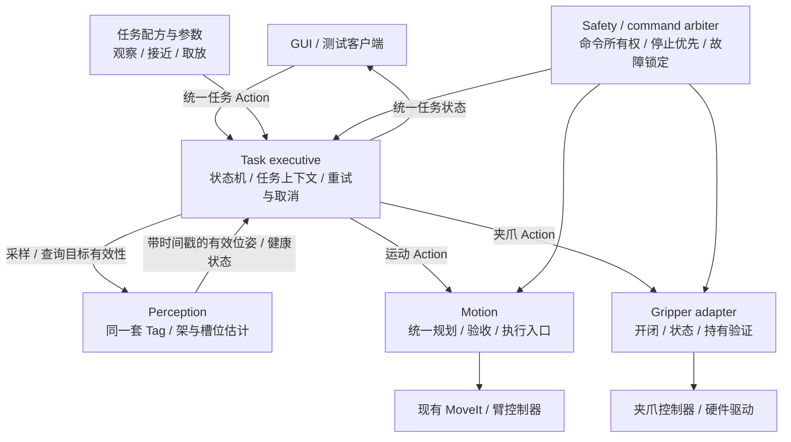

# 从实验流程 node 转向可组合任务

2026-09-30：本文件保留重构前的诊断和目标建议。其能力拆分、视觉观察/接近配方共用一个执行 node 已在本次分支实施，详见 [模块与任务](MODULES_AND_TASKS.md)；独立能力服务器、统一视觉 Action/停止和物理取放仍未实现。未选定新的 ROS/硬件栈。当前真实运行图仍见 [SYSTEM_ARCHITECTURE.md](SYSTEM_ARCHITECTURE.md)。

## 当前判断

目前应用层确实偏向“新增实验 → 新增完整流程 node”，而不是复用稳定能力接口组成任务。底层 MoveIt、关节控制器、TF、相机 bridge 已经复用；问题主要在这些底层之上的实验业务代码。

| 代码 | 当前耦合 |
| --- | --- |
| `pre_observation_demo.py` | 同时做粗命令生成、图像接收、Tag 定位、架平面估计、运动请求、流程调度和验收 |
| `transfer_demo.py` | 内部重新组织目标等待、MoveIt/Cartesian 请求、运动验收及搬运步骤 |
| `trajectory_demo.py` | 自己持有规划/执行客户端和完整测试顺序 |
| `sim_supervisor.py` | 通过启动 trajectory_demo 子进程提供 Observe；还没有组合可复用能力服务 |
| GUI `sensor_preview.py` | 为显示另外做一次 Tag 检测，不能视作控制感知结果的统一来源 |

这些是实验验证入口，适合最初分别跑通功能；继续沿用为正式业务入口，就会出现多套运动调用、流程、状态和停止路径。这也是视觉接近和旧固定搬运不能直接拼接的原因：名字看起来都是任务步骤，但尚无共同的目标语义、TCP、取消/故障和状态契约。

## 核心原则

**node 按职责和生命周期划分；任务按步骤和参数组合。一个原子动作不必对应一个 node。**

“对齐”“抬升”“下降”可以是同一个 motion node 的不同调用。“旋转四元数”“双 Tag PnP”“编码图片”应首先是普通可复用函数/模块，不应为了“原子化”再拆出多个网络参与者。

只有确实需要独立数据源、独立硬件控制、持续发布、隔离故障或独立部署的职责，才建立 node 边界。源/目标槽、相机模式和距离变化，应由参数/任务数据表达，而不是复制一个 node。

## 建议的目标结构：尚未实现



这些框表示逻辑职责，**不承诺每个框必须是独立进程或新 package**。第一步可在现有 package 内抽模块、建立清晰接口，再根据实时性和部署需要拆 node。

| 逻辑能力 | 可复用原子操作 | 应返回什么 |
| --- | --- | --- |
| 感知 | 获得新观察、估计架/槽位、检查目标有效性 | 时间戳、frame、目标 ID、位姿、质量/失败原因 |
| 运动 | 移动到位姿、约束接近、直线抬升/下降 | 接受/反馈/结果、实际误差、错误码、取消结果 |
| 夹爪 | 打开、闭合、检查是否持有、释放验证 | 实际位置/力或可用反馈、持有状态、超时/故障 |
| 任务执行 | 选择步骤、维护上下文、有限重试、失败恢复 | 唯一 request_id、阶段、终态、明确失败原因 |
| 安全与仲裁 | 允许/拒绝命令、停止、确认、复位 | 锁定状态、新鲜反馈、停止是否确认 |

## 新任务如何组合

下面是**建议的任务配方**，不是当前已经可以执行的 API。

```text
视觉观察：
  MoveTo(pre_observation_pose)
  AcquireFreshRackObservation(required_tags=[1,2])

视觉接近：
  视觉观察
  Align(target, standoff=0.40 m)
  ObserveAndValidate()
  BoundedRealignIfNeeded()
  ConstrainedApproach(target, standoff=0.10 m)

试管取放：
  获取源槽和目标槽的有效位姿
  将槽位目标转换为已标定的抓取 TCP 目标
  OpenGripper()
  MoveTo(pregrasp)
  Approach(grasp)
  CloseGripper()
  VerifyHeld()               # 不允许用运动到位代替持有成功
  Lift(clearance)
  Transfer(preplace)
  Descend(place)
  OpenGripper()
  VerifyReleasedAndSeated()
  Retreat()
```

同一 executive 从这些能力组成任务。未来“换到另一个槽”“从上层架取到桌面架”“加一步底盘停靠”应复用已有能力并改变配方/参数，任务种类增加时不增加一套完整流程 node。

数据应写入任务上下文：源/目标槽 ID、相机观察时间、frame、标定版本、抓取 TCP、目标位姿、允许误差、夹爪是否持有。不能只串联函数名称，而忽略两个步骤的输入坐标、对象身份和后置条件是否一致。

## 接口与命令所有权

- 传感器/状态走 Topic；短查询用 Service；运动、抓取、完整任务等耗时操作用 Action，明确反馈、结果和取消。
- 现有 `ExecuteTask` 可以作为统一入口的起点，但它当前只有 operation/slot/target，无法完整表达双槽取放及上下文。需要先定义版本兼容的任务契约，不能假定现在已有完整执行器。
- 全流程只有一个 task executive 负责顺序，一条运动执行路径拥有机械臂。新任务不能绕过仲裁自己直接抢发控制器命令。
- 感知更新不自动触发动作；执行器检查时间戳、质量和标定后发出新请求。默认先使用段间观察与确定性状态机。
- 取消向正在执行的子 Action 传播；故障/停止锁定优先于任务重试；复位不自动续跑。停止确认与硬件急停仍是不同概念。
- GUI 订阅统一感知/任务状态，不维护另一份作为任务真值的感知结果。

## 建议的迁移顺序

1. **保留 demo 作为回归测试客户端**。固定参数的 demo 仍可存在，但不再是另一套正式控制实现。
2. **先抽公共运动与位姿估计模块**。保留现有误差限值，避免第一步就增加大量 node/package。
3. **建立唯一任务执行入口**。把“视觉观察→对齐→接近”放进同一执行器，GUI 通过标准 Action 调用；原 demo 改为客户端。
4. **统一取消/停止/任务状态**。现有 Observe supervisor 不再启动完整 demo 子进程来模拟通用任务能力。
5. **加入真实夹爪能力和取放后置条件**，验证持有、碰撞场景、随动与释放，再组合取放任务。
6. **按部署需要拆常驻感知/运动/夹爪适配节点**，最后扩展底盘适配；各能力内部算法仍保留为模块。

验收关键：添加一个“换源槽/目标槽”的任务，只修改任务参数或组合；GUI、感知、运动与停止实现保持同一份。取消能到达正在执行的动作；失败不能误报下一步成功；多个客户端不能同时控制机械臂。

本阶段建议优先把已有视觉接近流程改成第一个可组合任务，而不是继续增加新的完整实验 node，也不需要此时引入新的任务框架库。
